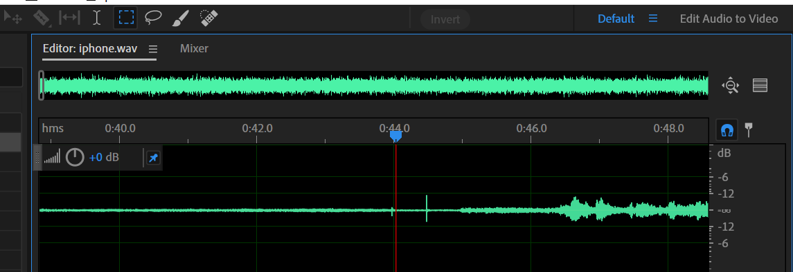

# Physical Vocoder and Adversarial Attack
- adversarial attack scripts: `./attack`
- physical vocoder: `./phys_vocoder`
- model checkpoints: `./pretrained_models`
- utils for audio clipping: `./audio_clipper`

## Guidelines to recovering audios
First, convert the device recording to `.wav` format with 16000 resample rate using ffmpeg: 
```bash
ffmpeg -i "input.wav" -osr 16000 output.wav
```

Set up the source audio and the folder you want to recover into in the script `audio_clipper/recover_pulse.py`.


Then, set the `offset` parameter to the observed first pulse point, as shown in the image, the first pulse is between 44-45 seconds, so set it to 44 * 16000:

